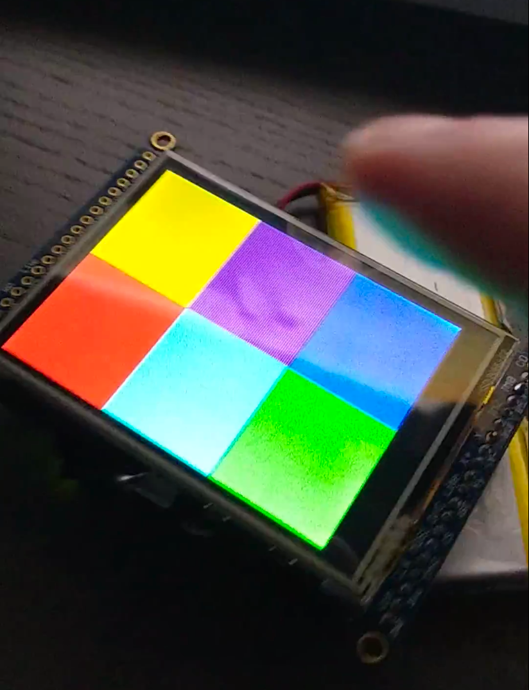
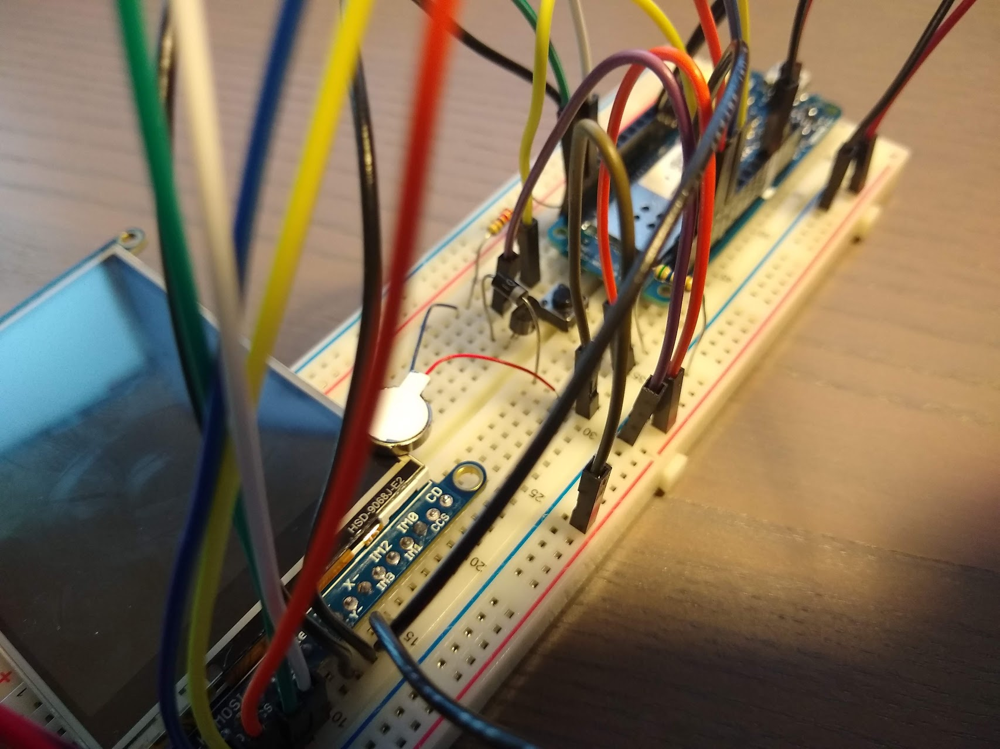
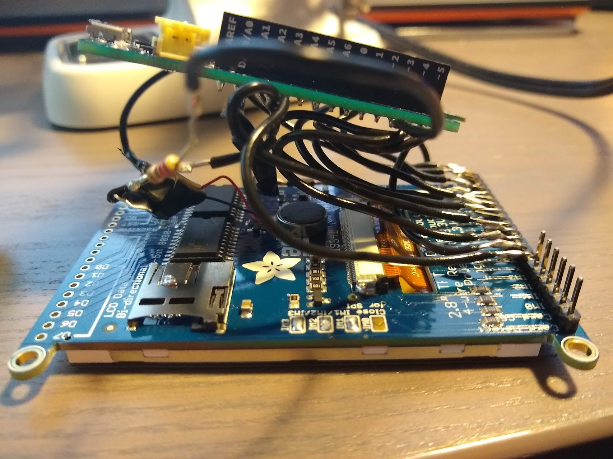
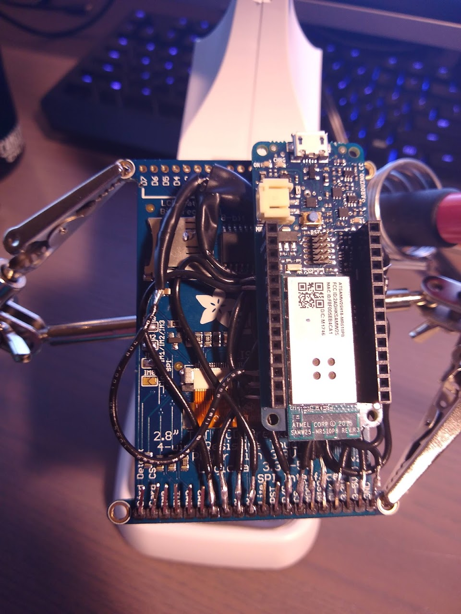

# Arduino IoT Touchscreen Remote
### This project is archived, no git history

This is a prototype reprogrammable IoT remote control with a touch screen.

Most of the work involved designing and building the physical device. I used a wifi board and touch screen connected to an arduino.

For the proof of concept, I divided the touchscreen into 6 virtual buttons connected to IFTTT endpoints I could customize on the fly. Dimming smart lights, tweeting, adjusting house temperature.... possibilities are endless!

### Showcase

